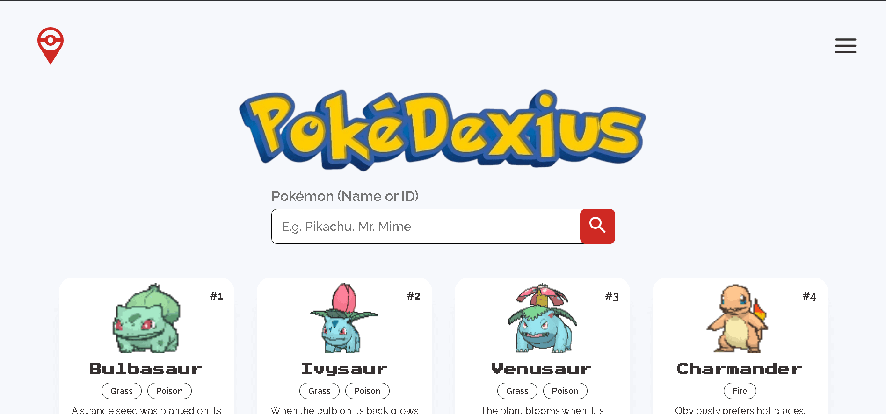
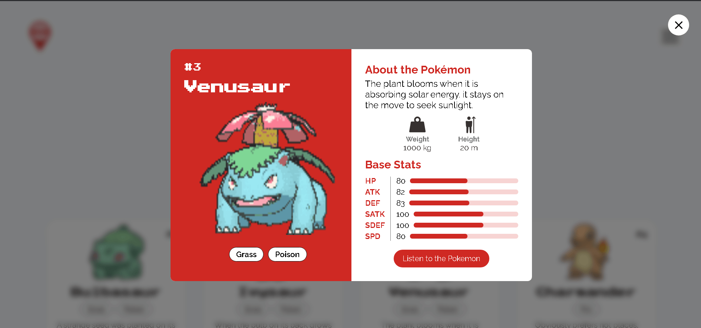

# PokeDexius: PokéDex APP

Pokedexius es una aplicación web diseñada para ofrecer una experiencia interactiva al usuario, permitiéndole explorar el vasto universo de los Pokémon a través de una interfaz moderna, intuitiva y completamente funcional. Utilizando la poderosa PokeAPI, la aplicación permite a los usuarios consultar, buscar y visualizar detalles de cada Pokémon, como sus estadísticas, habilidades y tipos, de manera fácil y accesible.
## Demo

[Demo](https://pokedexius.vercel.app/)

## Capturas de Pantalla

## Features

- **Búsqueda de Pokémon:** Los usuarios pueden buscar un Pokémon por nombre o ID utilizando un formulario de búsqueda intuitivo.
- **Paginación:** La Pokédex está organizada en páginas para mejorar la navegación y evitar la sobrecarga de información en una sola vista.
- **Detalles Específicos:** Al hacer clic en un Pokémon, se abre un modal emergente con información detallada sobre ese Pokémon, como estadísticas, tipos y habilidades.
- **Diseño Responsivo:** La aplicación está optimizada para ofrecer una experiencia de usuario coherente y fluida en dispositivos móviles, tabletas y computadoras de escritorio, siguiendo el enfoque Mobile-First.

## Tecnologías Empleadas

**Frontend:** HTML, CSS, Javascript, JavaScript Indexed DB
